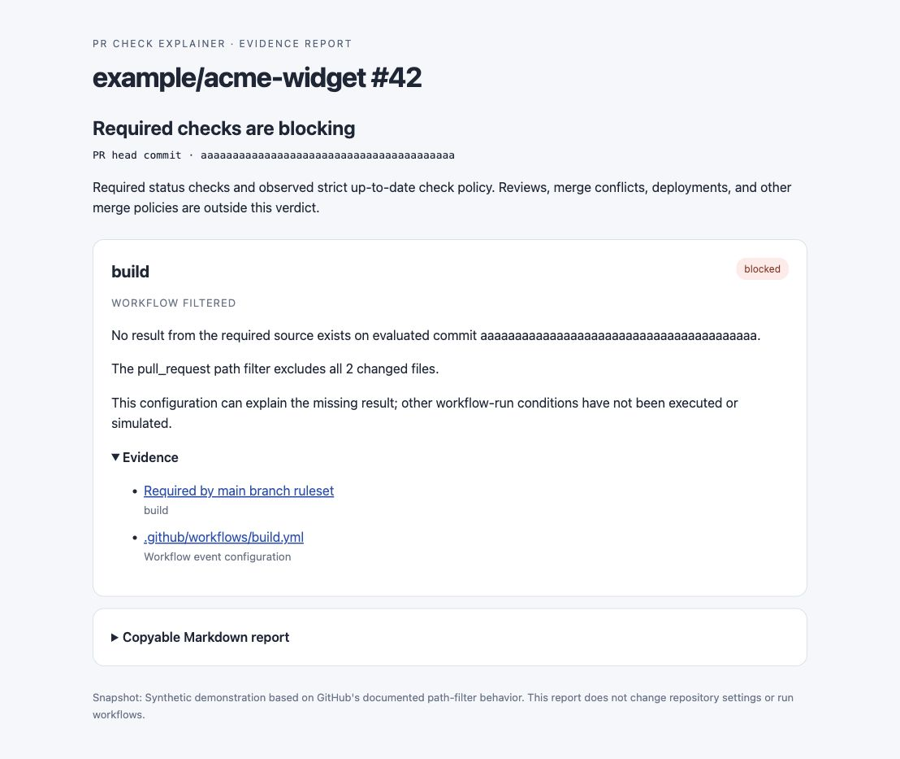

# GitHub PR Check Explainer: troubleshoot missing required checks

[](https://github.com/builtbysharath/gh-pr-check-explainer/actions/workflows/ci.yml)

**A pull request shows “Expected” and keeps waiting for a required status check. Which result is missing, and what can explain it?**

PR Check Explainer is a read-only CLI for developers troubleshooting GitHub required status checks. It names the missing requirement, checks the commit and reporting App, and connects supported workflow filters or job renames to the missing result. Incomplete evidence stays explicitly uncertain.



*Fictional example, not a diagnosis of a live repository. A workflow filter can explain a missing result; this tool does not run or simulate Actions.*

**[Explore the example report](https://builtbysharath.github.io/gh-pr-check-explainer/)**. No installation needed to view the fictional demonstration. Live PR analysis runs through the CLI on your own computer.

## Try it on a pull request

Requires **Node 22+** and [GitHub CLI](https://cli.github.com/) signed in with access to the repository. Run the pinned release without cloning or installing globally:

```sh
npm exec --yes --package=https://github.com/builtbysharath/gh-pr-check-explainer/releases/download/v0.1.0/gh-pr-check-explainer-0.1.0.tgz -- gh-pr-check-explainer --repo OWNER/REPO --pr NUMBER
```

npm downloads the GitHub release package and its dependencies. The tool uses your existing `gh` access to read GitHub data. It does not rerun workflows, post comments or change repository settings. The package is not published to the npm registry.

Prefer a checkout, or want the fictional sample?

```sh
git clone https://github.com/builtbysharath/gh-pr-check-explainer.git
cd gh-pr-check-explainer
npm ci
node bin/gh-pr-check-explainer.js --snapshot examples/path-filter.json
```

The sample intentionally exits `1` because a required check is blocked.

## What you get

- **Named missing checks**, including requirements that have no result to list.
- **Commit and App evidence**, so an older success or a different reporting App is not silently treated as satisfying the requirement.
- **Workflow explanations** for supported filters and static job renames, plus observed strict branch-freshness requirements.
- **Portable text, JSON, Markdown or HTML reports** with evidence links and coverage notes.

```sh
node bin/gh-pr-check-explainer.js --repo OWNER/REPO --pr NUMBER --format html --output report.html --save-snapshot evidence.json
```

From the current source checkout, you can also pass a standard PR URL:

```sh
node bin/gh-pr-check-explainer.js https://github.com/OWNER/REPO/pull/NUMBER --format html --output report.html
```

Use either the URL or `--repo`/`--pr`; a URL cannot be combined with those options or `--snapshot`. The pinned 0.1.0 release above retains its original flag-based interface.

Snapshots and reports can contain private workflow contents. Review them before sharing. HTML reports include a fixed local copy helper permitted by a CSP hash and no remote assets. Copy Markdown provides success or failure feedback; manual text selection remains available if clipboard access is unavailable.

## Where it helps and where it stops

The verdict covers **required status checks**, not every condition for merging. Live mode supports open PRs on GitHub.com. Matrix/reusable-workflow expansion and some complex filter patterns are outside this release's coverage. Missing permissions or ambiguous evidence produce an unknown verdict.

[Full coverage and limits](docs/COVERAGE.md) · [Captured comparison with GitHub CLI and gh-x](BENCHMARK.md) · [Validation evidence](VALIDATION.md)

The captured comparison shows one draft PR where this tool names an absent requirement omitted from the other captured summaries. Its root cause remains unconfirmed. More independent diagnoses and developer feedback are needed.

[Why is a required check waiting for a status?](docs/expected-status-check.md)

## Feedback and development

Did it clarify a stuck PR? [Open an issue](https://github.com/builtbysharath/gh-pr-check-explainer/issues/new) with a public PR link, the tool version and whether the explanation matched what you found. Sanitize private snapshots and never include tokens.

```sh
npm test
npm run check
```

Reusable analysis: `import {analyze} from './src/analyze.js'`. Exit codes: `0` observed checks satisfied/no required checks; `1` blocker; `2` incomplete evidence or error. See `--help` for options.

MIT licensed · [Releases](https://github.com/builtbysharath/gh-pr-check-explainer/releases) · [Contributing](CONTRIBUTING.md) · [Security](SECURITY.md) · [Dependency notices](THIRD_PARTY_NOTICES.md)
